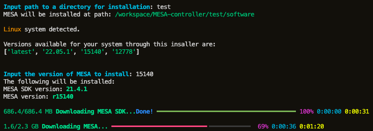

# MESA Python Operational Runtime Toolkit

<!-- <a href="https://zenodo.org/badge/latestdoi/589065195"></a> -->

#### A Python package to control [MESA](https://github.com/MESAHub/mesa) stellar evolution code


### Create, modify, run and share your MESA projects!  

### Features:

  * With Python and MESA installed, anyone can run your MESA model using this module. You only need to share your python project.

  * **MESA-PORT** can be used to create, clean, make, run and resume your MESA project.

  * This module also allows you to manipulate parameters in your inlist files. Your inputs will automatically be converted to the right data type and format for fortran. 

  * ***Install MESA*** on ***Linux*** and ***macOS*** (ARM/M-series and Intel) with just this python package!
    <details>
    <summary><b><i>CLI example</b></i></summary>
    
    </details>

  * MESA-PORT can also run [GYRE](https://github.com/rhdtownsend/gyre) stellar oscillation code! See [Usage](#usage).

<br>

## Installation

`pip install git+https://github.com/gautam-404/MESA-PORT.git`

## Usage
> [!NOTE]
> The complete module and submodules are documented [here](https://gautam-404.github.io/MESA-PORT/mesaport.html). Below are some examples to get you started.

#### ***The `ProjectOps` class:***
This class handle MESA operations. An object of this class allows you to create, clea, make, run, resume and delete your MESA project.
  * Creating a new MESA work directory:
    ```python
    from mesaport import  ProjectOps

    ## Initialize a new project
    proj = ProjectOps(name='work')   
    ## Default project name is 'work'. 

    ## Create a new project
    proj.create(overwrite=False, clean=False)    
    ## CLI is shown if no arguments are passed
    ```
> [!TIP]  
> Instead of single-star evolution, you can create a binary system or an astero project. This is done by passing boolean True for *binary* or *astero* arguments while initializing the ProjectOps class.
    
  * Take control of your project; make, clean, run, resume and delete.
    ```python
    proj.clean()
    proj.make()
    proj.run(silent=True, trace=None)                                    
    proj.resume("photo_name", silent=True, trace=None)
    proj.delete()                                             
    ## Deletes the project directory
    ```
> [!TIP]  
> A list of MESA parameters can be passed to the `trace` argument to print their evolution in terminal along with age. Eg., trace=["log_L", "log_Teff"]
    
  Please see the [docs](https://gautam-404.github.io/MESA-PORT/mesaport/Access/access_helper.html#toFortranType) for more details on these methods and more.
  <!-- * Run GYRE:
    ```python
    proj.runGyre("gyre/input")  
    ## "gyre/input" can either be a path to your GYRE input file
    ## or it can also be the name of a file in your_project or your_project/LOGS directory

    ## If you want to run a GYRE input file for all profile FGONG data files in your LOGS directory, 
    ## pass files="all" as an argument.
    proj.runGyre("gyre/input", files="all")

    ## If you want to run GYRE for specific FGONG files, pass file names as an argument.
    proj.runGyre("gyre/input", files=["profile1.data.FGONG", "profile2.data.FGONG"])
    ```
    GYRE can also be run for the primary or the secondary star in a binary system.
    ```python
    proj.runGyre("gyre_input.in", target="primary")  ## Target can be "primary" or "secondary"
    ``` -->

#### ***The `MesaAccess` class:***
  * This class gives you access to the parameters in your inlist files. You can write, read, remove and set default values for inlist parameters. 
  ```python
  from mesaport import  MesaAccess

  star = MesaAccess("your_project")

  ## Write
  star.set(parameters, values)              
  ## Inputs parameters can be a string or a list of strings
  ## Input values can be a single value or a list of values
  ## If a list of values is passed, the length of the list must be equal to the length of the parameters list.

  ## While using the 'set' method, you can also pass a dictionary.
  star.set({"parameter1":value1, "parameter2":value2, "parameter3":value3})
  
  ## Read
  value = star.get(parameters)   
  ## Inputs parameters can be a string or a list of strings

  ## Delete
  star.delete(parameters)
  ## Inputs parameters can be a string or a list of strings

  ## Set to default
  star.setDefualt(parameters)
  ```

  * In addition to the above, you can also use the `MesaAccess` class object to load your custom inlists and other input files such as history_columns, profile_columns, run_star_extras, run_binary_extras, inlist_astero_search_controls and inlist_pgstar files.
  
  ```python
  ### Path arguments can be a path or the name of a file in 'my_project' directory ###

  star.load_Extras("path/to/custom/run_star_extras_file")          ## Load custom run_star_extras.f90
  ## run proj.make() after loading extras. this allows the compiler to compile with the run_star_extras file
  star.load_InlistProject("/path/to/custom/inlist")                ## Load custom inlist_project 
  star.load_InlistPG("/path/to/custom/inlist")                     ## Load custom inlist_pgstar    
  star.load_HistoryColumns("path/to/custom/history_columns_file")  ## Load custom history_columns
  star.load_ProfileColumns("path/to/custom/profile_columns_file")  ## Load custom profile_columns
  star.load_InlistAsteroSearch("path/to/inlist")                   ## Load custom inlist_astero_search_controls
  ```

  * When working with a binary project, `MesaAccess` class object can be initialized for the primary star, secondary star and the binary system. This allows you to manipulate input parameters for each star and the binary system separately.
  ```python
  binary = MesaAccess("your_project", binary=True, target='binary')        ## For the binary system
  primary = MesaAccess("your_project", binary=True, target='primary')      ## For the primary star
  secondary = MesaAccess("your_project", binary=True, target='secondary')  ## For the secondary star
  
  ## Parameters can be accessed using the same methods as above
  ## For example:
  binary.set("binary_mass_ratio", 0.5)
  primary.set("profile_interval", 50)
  secondary.set("history_interval", 1)

  ## Load custom input files 
  primary.load_InlistProject("/path/to/custom/inlist")          ## Load custom 'inlist1'
  secondary.load_InlistProject("/path/to/custom/inlist")        ## Load custom 'inlist2'
  binary.load_InlistProject("/path/to/custom/inlist")           ## Load custom 'inlist_project' for the binary system
  binary.load_Extras("path/to/custom/run_binary_extras_file")   ## Load custom run_binary_extras.f90
  ```
 
> [!WARNING]
> MESA-PORT is a work in progress. Please report any issues or bugs you encounter. 